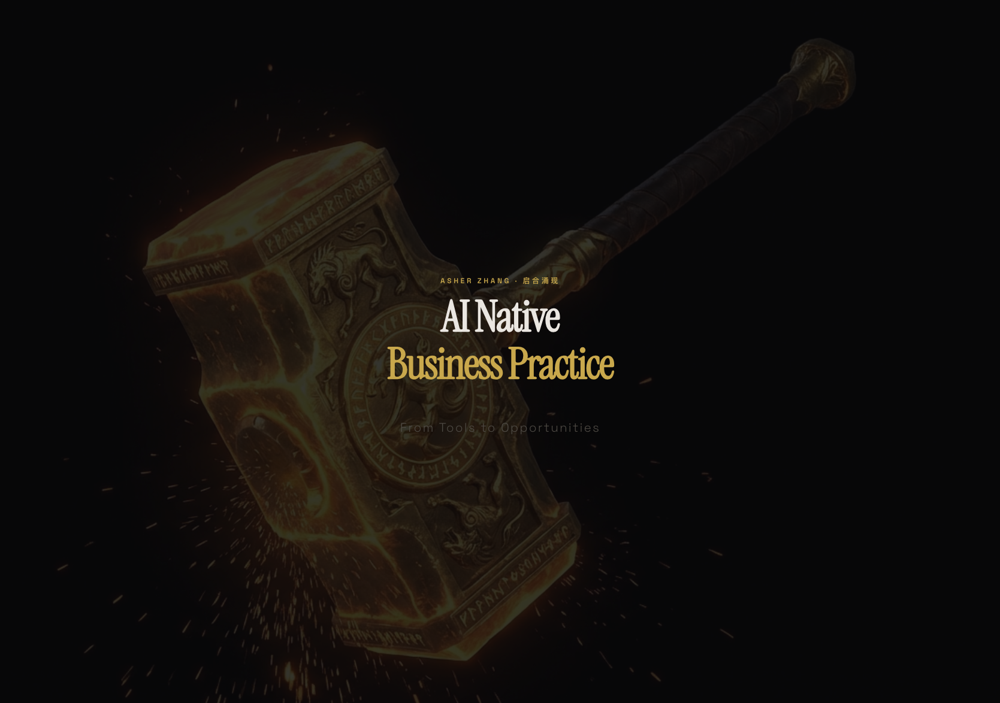
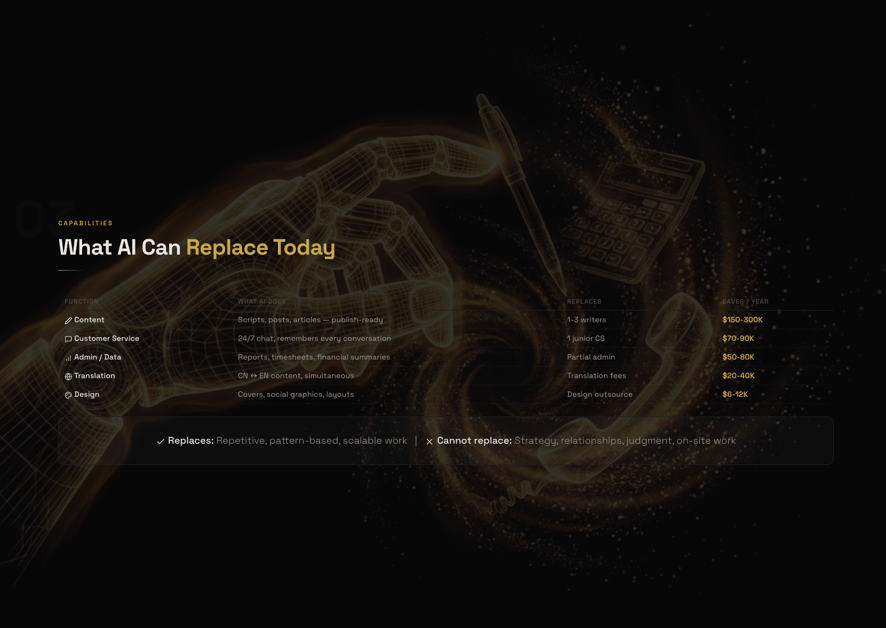
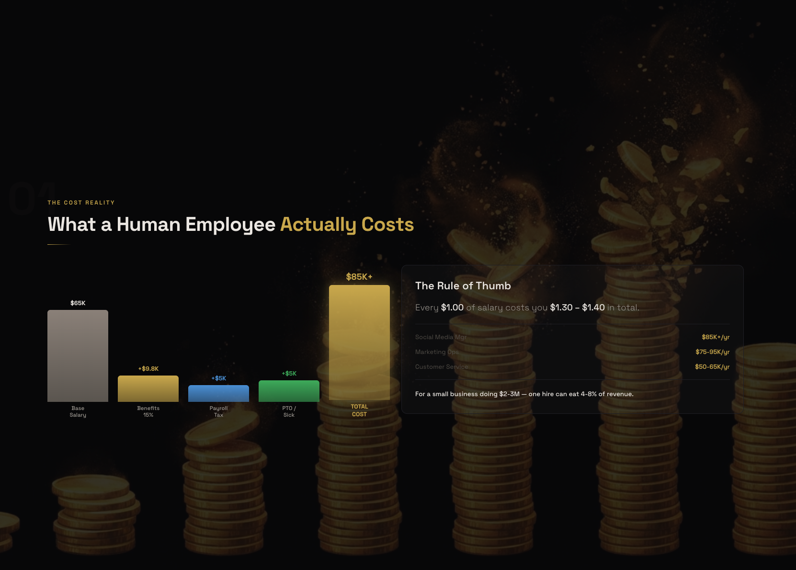
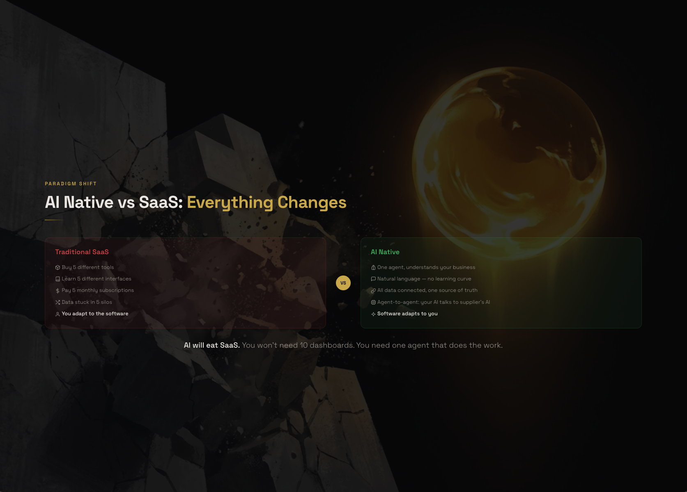
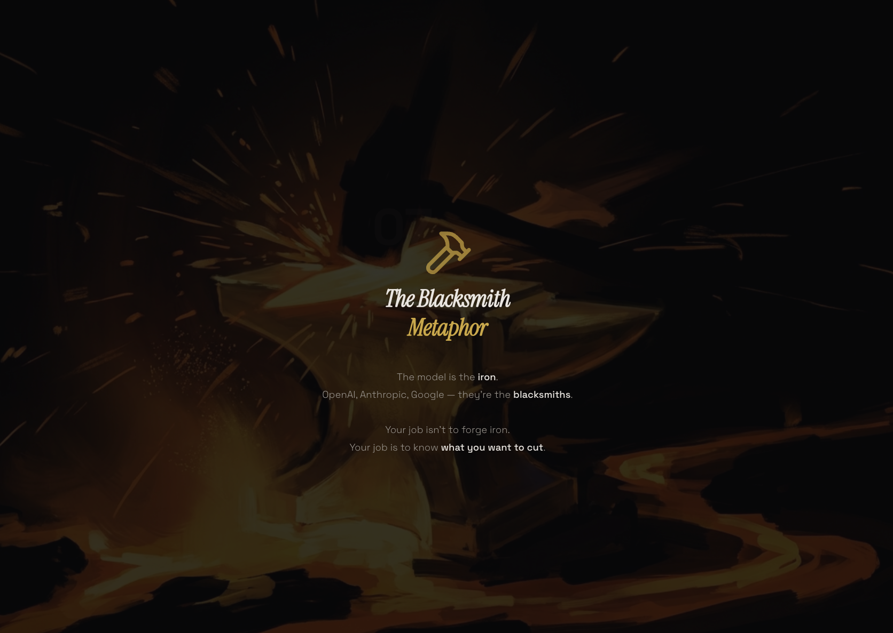
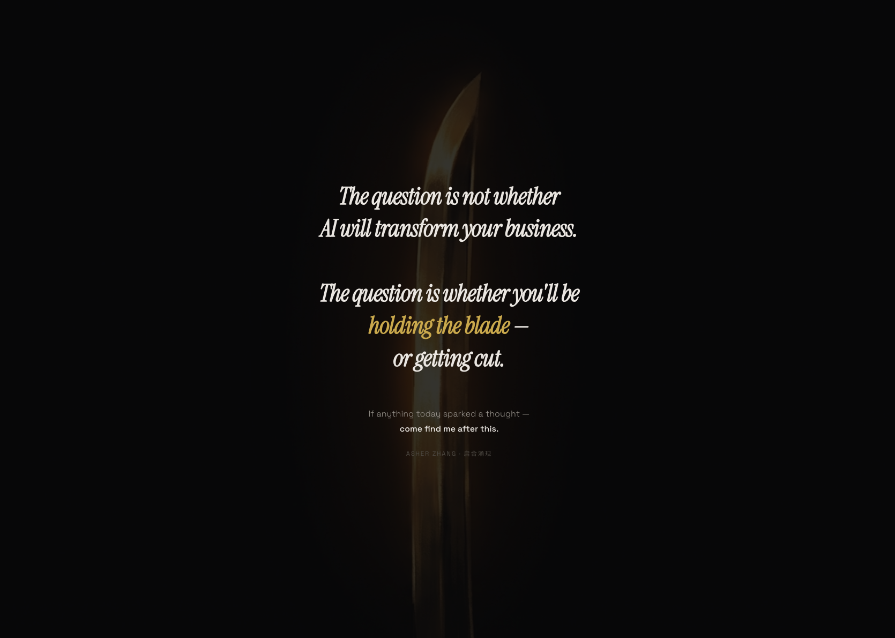

<div align="center">

# Asyre Presentation

**Create client-ready presentation pages in minutes, not hours.**


[**中文版**](README_CN.md)

<br>



*AI Native Business Practice — built with Asyre Presentation in 15 minutes.*

</div>

<br>

---

## Why This Exists

You need to present ideas to a client. You open PowerPoint, fight with templates, export a PDF, and email it. The client opens it on their phone — it looks terrible.

Or you spend 3 hours hand-coding a beautiful HTML page. It looks amazing, but the next client needs a completely different style. Start over.

**Asyre Presentation solves this.** Describe what you want, pick a visual style, and get a production-ready HTML presentation — single file, zero dependencies, works on any device.

But we go further than just "fast slides." We've built a complete **brand style system** that ensures visual consistency across every presentation you create — from the HTML layout to the AI-generated background images.

---

## Real Results

Every slide combines AI-generated concept art backgrounds with precise typography and layout. The result feels like a keynote at a dark theater, not a template from a slide library.

### AI Native Business Practice

A strategy deck explaining how AI transforms business operations. 12 slides, each with a unique visual metaphor.


*The cover: a golden hammer — the tool that shapes the future. Instrument Serif for the title, Space Grotesk for body text, pure black background.*



*Data-driven slide: concrete numbers on what AI can replace today, with cost estimates. The golden spiral in the background reinforces the "transformation" metaphor without distracting from the data.*



*"What a Human Employee Actually Costs" — stacked bar chart with The Rule of Thumb calculation. Golden coin stacks as background metaphor for financial weight.*



*Side-by-side comparison with a shattering globe — the old paradigm breaking apart. Color-coded columns (red for Traditional SaaS, green for AI Native) make the contrast instant.*



*"The model is the iron. OpenAI, Anthropic, Google — they're the blacksmiths. Your job isn't to forge iron. Your job is to know what you want to cut." Full-bleed concept art of a forge at work.*



*The closing slide: "The question is not whether AI will transform your business. The question is whether you'll be holding the blade — or getting cut." A single blade of light on black.*

---

## The Asyre Brand System

Most presentation tools give you templates. We give you a **brand identity system**.

### What's Inside

**1. Asyre Dark Gold** — Our signature visual style, extracted from real presentations that have been delivered to clients and conference audiences.

| Element | Specification |
|---------|--------------|
| Background | `#0a0a0b` pure black |
| Accent | `#c4a35a` amber gold |
| Display font (CN) | Noto Serif SC (900) |
| Display font (EN) | Space Grotesk (600/700) + Instrument Serif (italic) |
| Body font | Noto Sans SC / Space Grotesk (300/400) |
| Transitions | Horizontal push with expo easing |
| Layout | Left-aligned, asymmetric, generous padding |

This is defined in [`ASYRE_BRAND_PRESET.md`](ASYRE_BRAND_PRESET.md) with complete CSS variables, typography stacks, signature elements, and animation specs.

**2. AI Image Generation Style** — A proven prompt system for Gemini that produces atmospheric concept art backgrounds:

```
Abstract dark background illustration: [visual metaphor],
[golden/amber color direction].
Pure black background, very subtle and ethereal, low opacity feel.
Concept art, minimalist, suitable as a faded background image.
No text.
```

Every image follows these rules:
- Always pure black background + amber/gold tones
- Always concept art aesthetic, semi-transparent subjects with glowing edges
- Each slide gets a different metaphor (hammer = power, eye = perception, mirror = reflection, flame = vision)
- Never photorealistic, never neon/cyan (anti AI-slop)

**3. Brand Elevation via `.impeccable.md`** — For users who want to create their OWN brand preset (not use Asyre's), the skill includes a lightweight brand context workflow:

1. Answer 3 questions: audience, brand personality (3 words), aesthetic direction
2. A `.impeccable.md` file is generated with your design context
3. The AI uses this to customize fonts, colors, animations — even when starting from a preset

Or run `/teach-impeccable` for the full design context experience with codebase exploration and detailed UX questioning.

### Three Levels of Customization

| Level | What It Does | Speed | Brand Consistency |
|-------|-------------|-------|-------------------|
| **Level 0: Pure Preset** | Pick Asyre Dark Gold or any of 53+ styles | ~5 min | Template-level |
| **Level 1: Elevated Preset** | Preset + brand-aware tweaks via `.impeccable.md` | ~8 min | Brand-aligned |
| **Level 2: Custom Style** | AI synthesizes a new visual system from your brand context | ~15 min | Fully branded |

Every level can add AI background images. Every level outputs a single, self-contained HTML file.

---

## 53+ Style Library

Beyond the Asyre signature style, choose from 53 curated presets across 7 categories:

| Category | Examples | Best For |
|----------|----------|----------|
| Dark | Keynote Noir, Bold Signal, Neon Cyber | Product launches, conferences |
| Light | Swiss Modern, Paper & Ink, Pastel Geometry | Business meetings, teaching |
| Editorial | Editorial Serif, Fashion Editorial | Thought leadership, luxury brands |
| Bold | Electric Studio, Pop Art, Neon Brutalism | Startups, creative pitches |
| Retro | Art Deco Gatsby, Risograph, Vintage Poster | Stylized presentations |
| Artistic | Surrealism Gallery, Soft Dreamy | Art, design, portfolios |
| Cultural | 东方墨韵, 和風, Blueprint, Bauhaus | Cultural events, themed decks |

Browse them all: `open style-gallery.html`

---

## Installation

### Claude Code

```bash
git clone https://github.com/yzha0302/asyre-html-presentation ~/.claude/skills/asyre-presentation
```

Then use it:
```
/asyre-presentation
```

### OpenClaw

```bash
clawhub install asyre-presentation
```

### Other AI Tools

Use `SKILL.md` as a system prompt and reference the supporting files.

---

## Example Backgrounds

The `examples/backgrounds/` directory contains AI-generated images from real presentations — use them as reference or directly in your decks.

**`taming-the-blade/`** — Visual metaphors for an AI philosophy talk (Chinese):

| Image | Metaphor |
|-------|----------|
| `01-chainsaw` | Raw power — AI as an uncontrolled tool |
| `03-control` | Taking the reins |
| `05-mirror` | AI reflects its creator |
| `06-memory` | Three-layer memory system |
| `08-trust` | Building trust with AI |
| `10-eternal` | The long game |

**`ai-native-business/`** — Visual metaphors for a business strategy deck (English):

| Image | Metaphor |
|-------|----------|
| `s01-title-hammer` | The tool that shapes the future |
| `s02-cost` | The financial weight of human labor |
| `s04-replace` | Transformation spiral |
| `s08-forge` | The blacksmith's forge |
| `s12-blade` | The sharpened edge |

---

## Live Demos

These presentations were built with Asyre Presentation and are deployed live:

- **驯服利刃 (Taming the Blade)** — http://13.228.189.206/taming-the-blade/
- **AI Native Business Practice** — http://13.228.189.206/ai-native-business/

---

## File Structure

```
asyre-html-presentation/
├── SKILL.md                    # Core workflow (the AI reads this)
├── ASYRE_BRAND_PRESET.md       # Asyre Dark Gold style + AI image prompt system
├── DESIGN_ELEVATION.md         # How brand context elevates designs
├── STYLE_PRESETS.md            # 53 style definitions with CSS variables
├── html-template.md            # HTML/JS architecture, 11 slide types
├── animation-patterns.md       # Animation reference by mood
├── SCENARIO_TEMPLATES.md       # Narrative structures
├── viewport-base.css           # Mandatory responsive CSS
├── style-gallery.html          # Visual style browser
├── styles/                     # 43 reference implementations
├── scenarios/                  # 114 complete example presentations
├── examples/backgrounds/       # Real AI-generated background images
├── assets/screenshots/         # README screenshots
└── scripts/extract-pptx.py     # PowerPoint extraction tool
```

## Credits

- **[Next Slide](https://github.com/codesstar/next-slide)** by Callum — core presentation engine
- **Impeccable Design System** — design philosophy and anti-AI-slop quality gates

## License

MIT License. See [LICENSE](LICENSE).

---

<div align="center">

**Stop making slides. Start making impressions.**


Powered by [**Asyre**](https://github.com/yzha0302)

</div>
