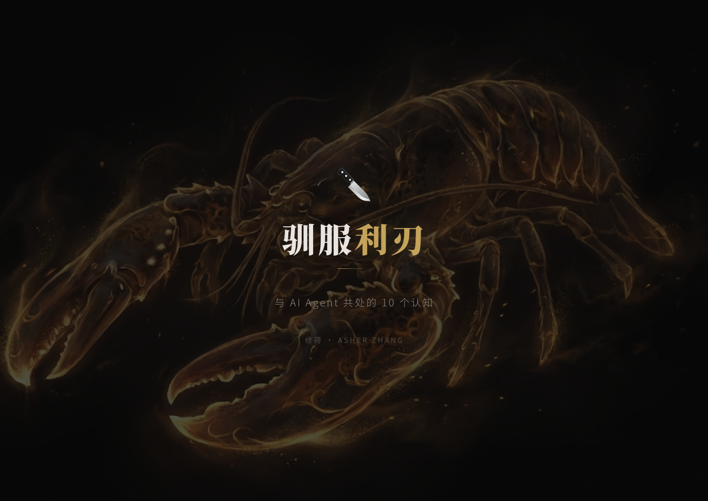
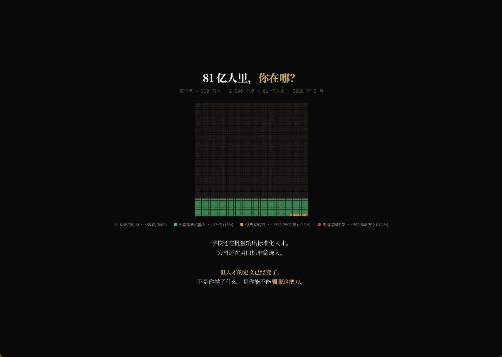
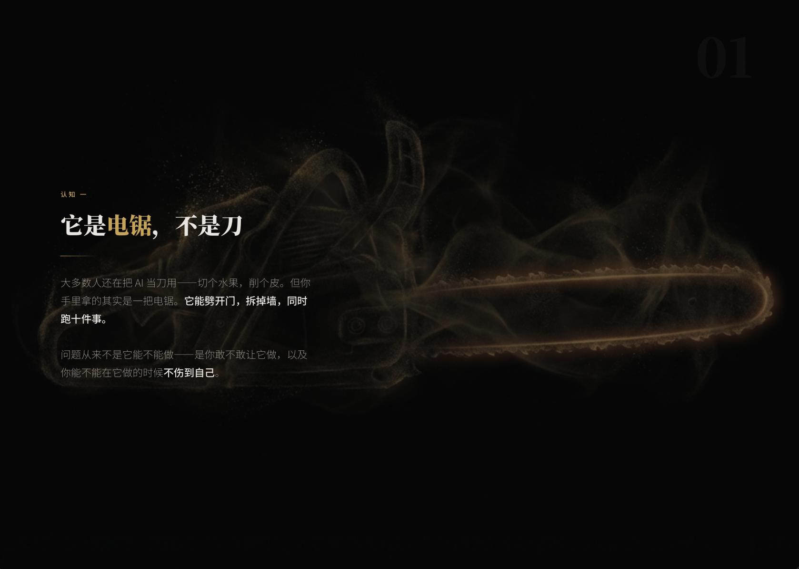
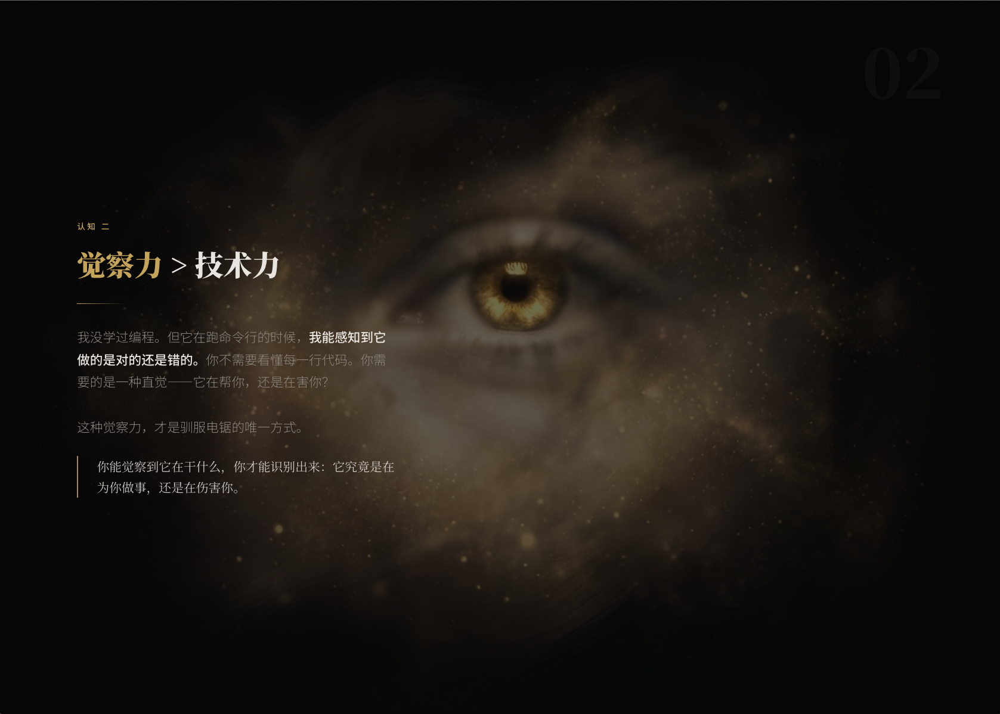
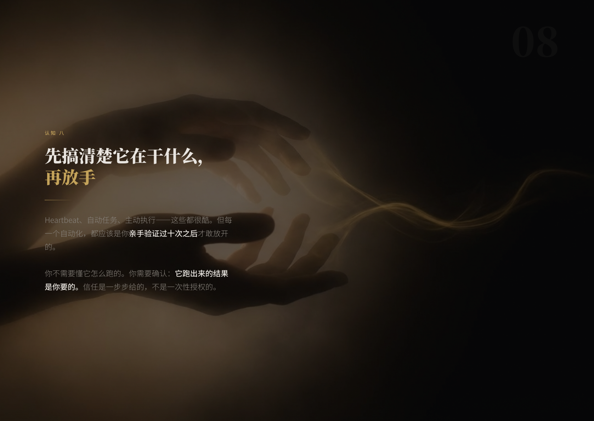

<div align="center">

# Asyre Presentation

**几分钟内为客户交付专业展示页，不是几小时。**


[**English**](README.md)

<br>



</div>

<br>

## 我们要解决的问题

你需要给客户展示一个方案 —— 产品介绍、策略汇报、项目 showcase。打开 PPT，跟模板较劲，导出 PDF，发邮件。客户在手机上打开 —— 排版全乱了。

**Asyre Presentation 解决这个问题。** 描述你的内容，选一个视觉风格，得到一个可直接交付的 HTML 展示页 —— 单文件、零依赖、任何设备都能打开。

## 实际效果

每页都融合了 AI 生成的概念艺术底图和精准的排版布局 —— 效果像是在暗色剧场里做 keynote，不是从模板库里拿的东西。

**封面 — 全幅 AI 底图 + 编辑级排版：**


**数据可视化 — 深色画布上的清晰布局：**



**内容页 — 每页都有独特的视觉隐喻作为底图：**

| | |
|---|---|
|  |  |

*左：「它是电锯，不是刀」—— 原始力量的隐喻。右：「觉察力 > 技术力」—— 用眼睛隐喻感知力。*

**信任与交互 — 氛围底图强化信息表达：**



*「先搞清楚它在干什么，再放手」—— 双手释放金色缰绳，信任的隐喻。*

## 工作流程

### 1. 描述你的内容

告诉 AI 你的展示页是关于什么的 —— 主题、受众、核心要点。可以贴笔记、传 Markdown 文件，甚至导入一个 PowerPoint 转换。

### 2. 选择视觉风格

**Asyre Dark Gold** 是默认推荐 —— 深色电影感背景、琥珀金色调、编辑衬线字体。或从 53+ 其他精选风格中挑选：

| 类别 | 代表风格 | 适用场景 |
|------|---------|---------|
| **Asyre Dark Gold** | *签名风格* | 客户方案、演讲、策略汇报 |
| 暗色 | Keynote Noir, Bold Signal, Neon Cyber | 产品发布、大会演讲 |
| 亮色 | Swiss Modern, Paper & Ink, Pastel Geometry | 商务会议、教学培训 |
| 编辑风 | Editorial Serif, Fashion Editorial | 思想领导力、奢侈品牌 |
| 大胆创意 | Electric Studio, Pop Art, Neon Brutalism | 创业路演、创意推介 |
| 复古 | Art Deco Gatsby, Risograph | 风格化展示 |
| 艺术 | Surrealism Gallery, Soft Dreamy | 艺术设计、作品集 |
| 文化特色 | 东方墨韵, 和風, Blueprint, Bauhaus | 文化活动、主题展示 |

### 3. AI 氛围底图（可选）

每一页都可以有独特的 AI 生成氛围背景。不是字面插图 —— 是抽象的视觉隐喻，增加层次感。

生图遵循经过实战验证的风格系统：
- **始终** 纯黑背景 + 琥珀金色调
- **始终** 概念艺术风格，半透明主体
- **每页** 不同的隐喻（电锯 = 力量，眼睛 = 感知，镜子 = 反思，火焰 = 长期主义）
- **绝不** 写实风格，绝不 neon/cyan（反 AI slop）

查看 `examples/backgrounds/` 目录获取真实演讲中使用的 AI 生成图片。

### 4. 获得你的展示页

一个 HTML 文件。本地打开、一条命令部署到 URL、或导出 PDF。

## 三级定制深度

| 级别 | 做什么 | 速度 |
|------|-------|------|
| **Level 0: 纯预设** | 从 53+ 个风格中选一个，直接生成 | ~5 分钟 |
| **Level 1: 预设提升** | 预设 + 通过 `.impeccable.md` 品牌化微调 | ~8 分钟 |
| **Level 2: 自定义风格** | AI 从品牌上下文合成全新视觉体系 | ~15 分钟 |

每个级别都可以叠加 AI 背景图。

## 安装

### Claude Code

```bash
git clone https://github.com/yzha0302/asyre-html-presentation ~/.claude/skills/asyre-presentation
```

使用：
```
/asyre-presentation
```

### OpenClaw

```bash
clawhub install asyre-presentation
```

### 其他 AI 工具

将 `SKILL.md` 作为 system prompt，引用支持文件即可。

## 示例底图

`examples/backgrounds/` 目录包含真实演讲中使用的 AI 生成图片：

**`taming-the-blade/`** — AI 哲学演讲的视觉隐喻系列：

| 图片 | 隐喻 |
|------|------|
| `01-chainsaw` | 原始力量 — AI 如同未驯服的电锯 |
| `02-perception` | 我们如何看待 AI |
| `03-control` | 掌握控制权 |
| `05-mirror` | AI 映射创造者 |
| `06-memory` | AI 记住了什么 |
| `08-trust` | 建立与 AI 的信任 |
| `10-eternal` | 长期博弈 |

**`ai-native-business/`** — AI 原生商业策略演讲：

| 图片 | 隐喻 |
|------|------|
| `s01-title` | 开场宣言 |
| `s02-cost` | 不用 AI 的代价 |
| `s04-replace` | AI 替代了什么 |
| `s08-forge` | 锻造新能力 |
| `s12-blade` | 磨利的刃 |

## 在线示例

以下展示页由 Asyre Presentation 制作，已部署在服务器上：

- **驯服利刃** — http://13.228.189.206/taming-the-blade/
- **AI Native Business** — http://13.228.189.206/ai-native-business/

## 文件结构

```
asyre-html-presentation/
├── SKILL.md                    # 核心工作流（AI 读取这个文件）
├── ASYRE_BRAND_PRESET.md       # Asyre Dark Gold 品牌风格 + 生图提示系统
├── DESIGN_ELEVATION.md         # 品牌上下文如何提升设计
├── STYLE_PRESETS.md            # 53 个风格定义（含 CSS 变量）
├── html-template.md            # HTML/JS 架构 + 11 种幻灯片类型
├── animation-patterns.md       # 按情绪分类的动画参考
├── SCENARIO_TEMPLATES.md       # 叙事结构
├── viewport-base.css           # 强制响应式 CSS
├── style-gallery.html          # 风格浏览器
├── styles/                     # 43 个风格参考实现
├── scenarios/                  # 114 个完整示例演示
├── examples/backgrounds/       # 实战 AI 生成底图
└── scripts/extract-pptx.py     # PowerPoint 提取工具
```

## 致谢

- **[Next Slide](https://github.com/codesstar/next-slide)** by Callum — 核心演示引擎
- **Impeccable Design System** — 设计哲学与反 AI Slop 质量体系

## License

MIT License. 详见 [LICENSE](LICENSE)。

---

<div align="center">

**别再做幻灯片了。做让人记住的东西。**


Powered by [**Asyre**](https://github.com/yzha0302)

</div>
