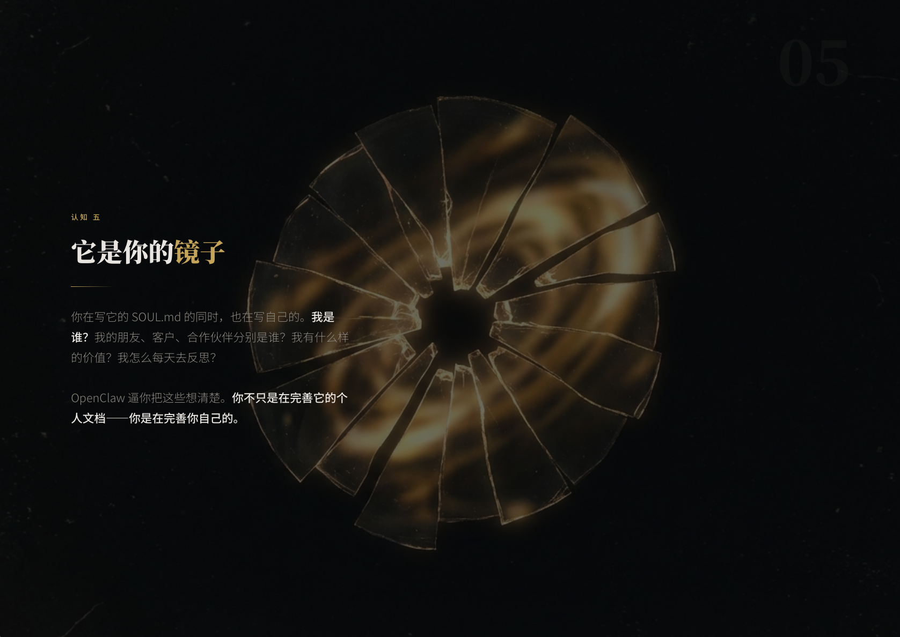
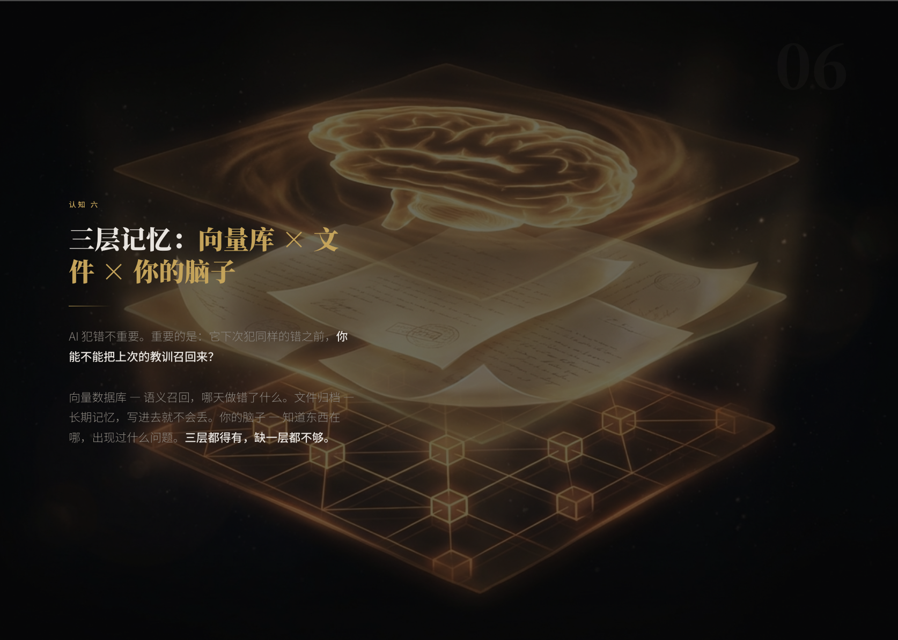

<div align="center">

# Asyre Presentation

**几分钟内为客户交付专业展示页，不是几小时。**


[**English**](README.md)

<br>


*驯服利刃 — 与 AI Agent 共处的 10 个认知。用 Asyre Presentation 制作。*

</div>

<br>

---

## 为什么做这个

你需要给客户展示一个方案。打开 PPT，跟模板较劲，导出 PDF，发邮件。客户在手机上打开 —— 排版全乱了。

**Asyre Presentation 解决这个问题。** 描述内容，选风格，得到一个可交付的 HTML 展示页 —— 单文件、零依赖、任何设备打开。

但我们不只是「快速做幻灯片」。我们构建了一套完整的**品牌视觉体系**，从 HTML 布局到 AI 生成的底图，确保你做的每一份演示都有一致的品牌感。

---

## 实际效果

每页都融合了 AI 生成的概念艺术底图和精准排版 —— 效果像在暗色剧场做 keynote，不是从模板库拿的东西。

### 驯服利刃 — 与 AI Agent 共处的 10 个认知

一场关于如何与 AI 共处的哲学性演讲。10 页，每页一个独特的视觉隐喻。


*封面：金色巨型龙虾 —— 力量与未知的隐喻。Noto Serif SC 标题字体，纯黑背景，72% 暗色遮罩。*


*「81 亿人里，你在哪？」—— 2500 个点代表 81 亿人类，用色块区分 AI 使用深度。数据冲击力 + 干净的信息层次。*

**内容页 — 每页都有独特的视觉隐喻作为底图：**

| | |
|---|---|
|  |  |

*左：「它是电锯，不是刀」—— 01 章节，电锯溶解为金色能量粒子。右：「觉察力 > 技术力」—— 02 章节，金色虹膜的眼睛。*

| | |
|---|---|
|  |  |

*左：「它是你的镜子」—— 05 章节，碎裂的镜子映射自我。右：「三层记忆：向量库 × 文件 × 你的脑子」—— 06 章节，三层透明结构。*


*「先搞清楚它在干什么，再放手」—— 08 章节，双手释放金色缰绳。*

### AI Native Business Practice

一份英文策略展示，解释 AI 如何改变商业运作。12 页，每页一个隐喻。


*「一个人类员工到底花多少钱？」—— 堆叠柱状图 + The Rule of Thumb 计算。金色硬币堆叠作为财务重量的隐喻。*


*「模型是铁。OpenAI、Anthropic、Google —— 他们是铁匠。你的工作不是打铁，是知道你要切什么。」全幅锻造场景。*

---

## Asyre 品牌体系

大多数演示工具给你模板。我们给你**品牌身份系统**。

### 体系包含什么

**1. Asyre Dark Gold** —— 我们的签名视觉风格，从真实的客户演示和大会演讲中提炼。

| 元素 | 规格 |
|------|------|
| 背景 | `#0a0a0b` 纯黑 |
| 主色 | `#c4a35a` 琥珀金 |
| 中文标题 | Noto Serif SC (900) |
| 英文标题 | Space Grotesk (600/700) + Instrument Serif (斜体) |
| 正文 | Noto Sans SC / Space Grotesk (300/400) |
| 过渡动效 | 水平推进 + expo 缓动 |
| 布局 | 左对齐、不对称、充裕的内边距 |

完整定义在 [`ASYRE_BRAND_PRESET.md`](ASYRE_BRAND_PRESET.md) 中，包含 CSS 变量、字体栈、签名元素、动效参数。

**2. AI 生图风格系统** —— 经过实战验证的 Gemini 概念艺术提示模板：

```
Abstract dark background illustration: [视觉隐喻],
[金色/琥珀色调描述].
Pure black background, very subtle and ethereal, low opacity feel.
Concept art, minimalist, suitable as a faded background image.
No text.
```

规则：
- 始终纯黑背景 + 琥珀金色调
- 始终概念艺术风格，半透明主体 + 发光边缘
- 每页不同隐喻（锤子 = 力量，眼睛 = 感知，镜子 = 反思，火焰 = 愿景）
- 绝不写实风格，绝不 neon/cyan（反 AI slop）

**3. 构建你自己的品牌预设** —— 不想用 Asyre 风格？用内置的品牌上下文工作流创建你自己的：

1. 回答 3 个问题：受众、品牌个性（3 个词）、美学方向
2. 生成 `.impeccable.md` 设计上下文文件
3. AI 会用它来定制字体、配色、动效 —— 即使从一个预设开始

或者运行 `/teach-impeccable` 获得完整的设计上下文体验 —— 包含代码库探索和详细的 UX 问卷。

### 三级定制深度

| 级别 | 做什么 | 速度 | 品牌一致性 |
|------|-------|------|-----------|
| **Level 0: 纯预设** | 选 Asyre Dark Gold 或 53+ 其他风格 | ~5 分钟 | 模板级 |
| **Level 1: 预设提升** | 预设 + 通过 `.impeccable.md` 品牌微调 | ~8 分钟 | 品牌对齐 |
| **Level 2: 自定义风格** | AI 从品牌上下文合成全新视觉体系 | ~15 分钟 | 完全品牌化 |

每级都可叠加 AI 背景图。每级都输出单个自包含 HTML 文件。

---

## 53+ 风格库

除了 Asyre 签名风格，还有 53 个精选预设覆盖 7 大类别：

| 类别 | 代表风格 | 适用场景 |
|------|---------|---------|
| 暗色 | Keynote Noir, Bold Signal, Neon Cyber | 产品发布、大会 |
| 亮色 | Swiss Modern, Paper & Ink, Pastel Geometry | 商务、教学 |
| 编辑风 | Editorial Serif, Fashion Editorial | 思想领导力、奢侈品 |
| 大胆创意 | Electric Studio, Pop Art, Neon Brutalism | 创业路演 |
| 复古 | Art Deco Gatsby, Risograph | 风格化展示 |
| 艺术 | Surrealism Gallery, Soft Dreamy | 设计、作品集 |
| 文化特色 | 东方墨韵, 和風, Blueprint, Bauhaus | 文化活动 |

浏览所有风格：`open style-gallery.html`

---

## 安装

### Claude Code

```bash
git clone https://github.com/yzha0302/asyre-html-presentation ~/.claude/skills/asyre-presentation
```

使用：
```
/asyre-presentation
```

### OpenClaw

```bash
clawhub install asyre-presentation
```

### 其他 AI 工具

将 `SKILL.md` 作为 system prompt，引用支持文件即可。

---

## 示例底图

`examples/backgrounds/` 目录包含真实演讲中使用的 AI 生成图片。

**`taming-the-blade/`** — AI 哲学演讲（中文）：

| 图片 | 隐喻 |
|------|------|
| `01-chainsaw` | 原始力量 — 未驯服的电锯 |
| `03-control` | 掌握控制权 |
| `05-mirror` | AI 映射创造者 |
| `06-memory` | 三层记忆系统 |
| `08-trust` | 建立信任 |
| `10-eternal` | 长期博弈 |

**`ai-native-business/`** — 商业策略演讲（英文）：

| 图片 | 隐喻 |
|------|------|
| `s01-title-hammer` | 塑造未来的工具 |
| `s02-cost` | 人力的财务重量 |
| `s04-replace` | 变革的螺旋 |
| `s08-forge` | 铁匠的锻造炉 |
| `s12-blade` | 磨利的刃 |

---

## 在线示例

以下展示页由 Asyre Presentation 制作，已部署上线：

- **驯服利刃** — http://13.228.189.206/taming-the-blade/
- **AI Native Business** — http://13.228.189.206/ai-native-business/

---

## 文件结构

```
asyre-html-presentation/
├── SKILL.md                    # 核心工作流（AI 读取这个文件）
├── ASYRE_BRAND_PRESET.md       # Asyre Dark Gold 品牌风格 + 生图提示系统
├── DESIGN_ELEVATION.md         # 品牌上下文如何提升设计
├── STYLE_PRESETS.md            # 53 个风格定义（含 CSS 变量）
├── html-template.md            # HTML/JS 架构 + 11 种幻灯片类型
├── animation-patterns.md       # 按情绪分类的动画参考
├── SCENARIO_TEMPLATES.md       # 叙事结构
├── viewport-base.css           # 强制响应式 CSS
├── style-gallery.html          # 风格浏览器
├── styles/                     # 43 个风格参考实现
├── scenarios/                  # 114 个完整示例演示
├── examples/backgrounds/       # 实战 AI 生成底图
├── assets/screenshots/         # README 配图
└── scripts/extract-pptx.py     # PowerPoint 提取工具
```

## 致谢

- **[Next Slide](https://github.com/codesstar/next-slide)** by Callum — 核心演示引擎
- **Impeccable Design System** — 设计哲学与反 AI Slop 质量体系

## License

MIT License. 详见 [LICENSE](LICENSE)。

---

<div align="center">

**别再做幻灯片了。做让人记住的东西。**


Powered by [**Asyre**](https://github.com/yzha0302)

</div>
